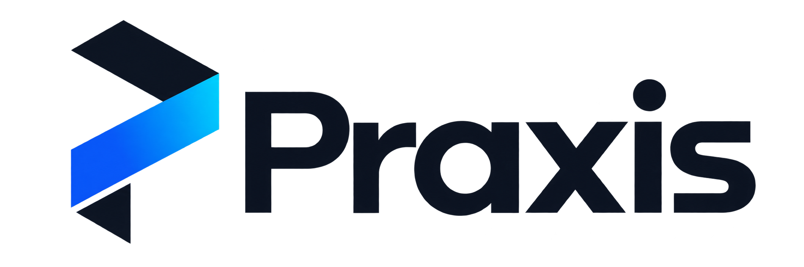
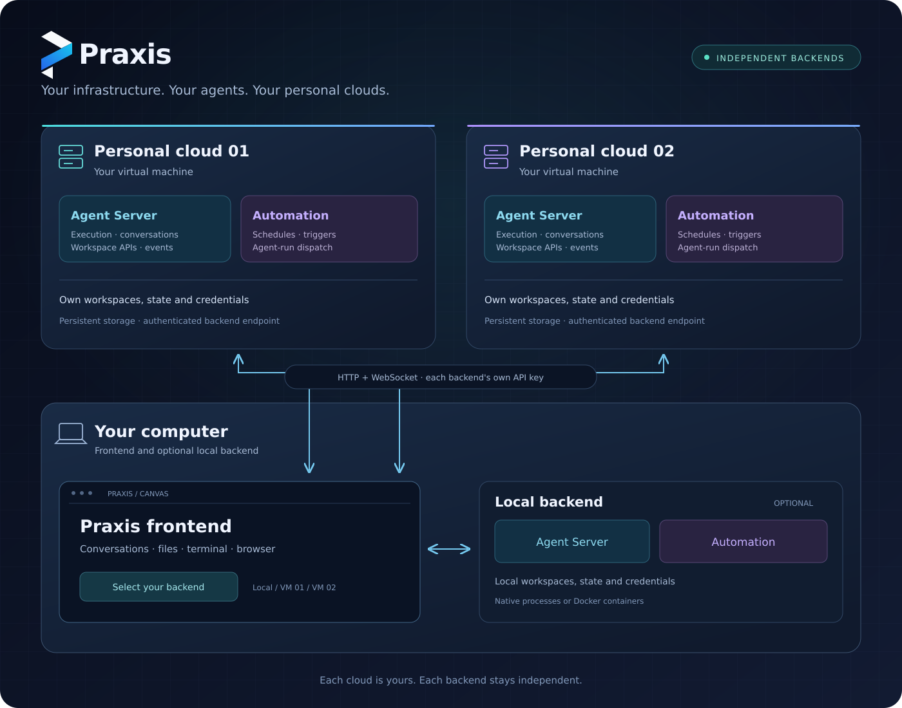

<p align="center">
  <picture>
    <source media="(prefers-color-scheme: dark)" srcset="docs/assets/brand/praxis-primary-white.png">
    
  </picture>
</p>

# Praxis

Praxis is a workspace for agent-assisted software development. Use its Canvas to work with conversations, files, terminals, browser sessions and automations, while your backend runs the agents on infrastructure you control.

Run everything on your computer, put the backend on a VM, or connect the same frontend to several independent backends. **Your VM is your personal cloud.** Each backend keeps its own workspaces, conversations, settings and credentials; switching backends does not synchronize their data.



## Choose how to run Praxis

| Setup                         | Where it runs                                                | Start here                                                                                                     |
| ----------------------------- | ------------------------------------------------------------ | -------------------------------------------------------------------------------------------------------------- |
| Native                        | Directly on Linux/macOS, or inside WSL 2                     | [Source quickstart](#quickstart-from-source) or [release archive](#install-a-published-release-without-docker) |
| Complete container            | Frontend and backend on one machine                          | [Docker quickstart](#docker-quickstart)                                                                        |
| Separate frontend and backend | Separate processes or containers, on one or several machines | [Distribution guide](docs/distribution/README.md)                                                              |
| Personal cloud                | Backend on your VM; frontend wherever you use Praxis         | [Personal clouds](#personal-clouds) and [self-hosting](docs/SELF_HOSTING.md)                                   |

## Quickstart from source

Install Git, Node.js 24 or later, npm and `uv` / `uvx`. On Windows, use [WSL 2](README.windows.md).

```sh
git clone https://github.com/Praxiss-Lab/Praxis.git
cd Praxis
npm ci
npm run dev
```

Open [http://localhost:8000](http://localhost:8000) and configure your model provider in the UI. This starts the frontend, Agent Server, Automation and ingress. Native agent execution can access the host filesystem: choose the workspace you intend to use.

To serve a production frontend build from the checkout:

```sh
npm run build
npm run dev:static
```

See the [development guide](docs/DEVELOPMENT.md) for mock mode, tests and builds.

## Install a published release without Docker

Install Node.js 24+, npm and `uv` / `uvx`, then download the Praxis archive from its [GitHub release](https://github.com/Praxiss-Lab/Praxis/releases/tag/v1.25.0):

```sh
curl -fL --output praxis-1.25.0.tgz \
  https://github.com/Praxiss-Lab/Praxis/releases/download/v1.25.0/openhands-agent-canvas-1.25.0.tgz
npm install -g ./praxis-1.25.0.tgz
agent-canvas
```

Open [http://localhost:8000/canvas/](http://localhost:8000/canvas/). Use the archive attached to the Praxis release; the executable remains `agent-canvas`. Package filenames and executable names are technical identifiers.

## Docker quickstart

Install Docker, choose your project directory, and start the released image:

```sh
export PRAXIS_IMAGE="ghcr.io/praxiss-lab/praxis:1.25.0"
export PROJECTS_PATH="$HOME/projects"
mkdir -p "$PROJECTS_PATH" "$HOME/.openhands"
docker pull "$PRAXIS_IMAGE"
docker run -it --rm --name praxis \
  -p 127.0.0.1:8000:8000 \
  -e PRAXIS_MODE=all \
  -e AGENT_CANVAS_ALLOW_LAN_SESSION_KEY=true \
  -v "$HOME/.openhands:/home/openhands/.openhands" \
  -v "${PROJECTS_PATH}:/projects" \
  "$PRAXIS_IMAGE"
```

Open [http://localhost:8000/canvas/](http://localhost:8000/canvas/). The mounted state directory preserves conversations and settings; `/projects` exposes your chosen host projects to the agent. `Ctrl+C` stops the container and leaves those directories intact.

The image supports Linux `amd64` and `arm64`; Docker selects the matching platform. Docker Desktop runs these Linux containers on Windows and macOS. [PowerShell instructions](README.windows.md) are available separately.

This quickstart publishes only on loopback and allows local session-key injection. For remote access, use explicit authentication and the network setup in the [self-hosting guide](docs/SELF_HOSTING.md). The generated Docker key can be read with:

```sh
docker exec praxis cat /home/openhands/.openhands/agent-canvas/api-key.txt
```

## Frontend and backend independently

| Mode     | Installed native launcher      | Container setting      | Services                                    |
| -------- | ------------------------------ | ---------------------- | ------------------------------------------- |
| Complete | `agent-canvas`                 | `PRAXIS_MODE=all`      | Frontend, Agent Server, Automation, ingress |
| Backend  | `agent-canvas --backend-only`  | `PRAXIS_MODE=backend`  | Agent Server, Automation, API ingress       |
| Frontend | `agent-canvas --frontend-only` | `PRAXIS_MODE=frontend` | Frontend server, optional backend proxy     |

All container modes use **one versioned image**. The mode selects the services to start; it does not reduce the downloaded image. Frontend and backend can run in separate containers, including on different devices.

From source, use `npm run dev -- --backend-only` or `npm run dev -- --frontend-only`. Choose separate ports if both processes run on one machine. The [distribution guide](docs/distribution/README.md) provides Compose and remote-backend examples.

## Personal clouds

A personal cloud is a Praxis backend running on a machine you control, such as a VM. Agent execution, workspaces, credentials and Automation live on that backend; the frontend connects to it over HTTP and WebSocket.

You can register several Agent Server backends in the backend selector and switch between them. Give each one its own name, address and API key. The backend URLs must be reachable from the browser for direct connections, or from the frontend container when using its configured proxy. Configure allowed origins for direct browser access.

Each backend is an independent installation. This model does not require a centralized cloud service and does not pool or replicate backend state.

## Conversation isolation

With Docker available on the host, an installed native launcher can use per-conversation containers:

```sh
OH_CONVERSATION_RUNTIME=docker agent-canvas
```

This isolates conversation execution while the frontend and Automation remain on the host. On Windows, run this mode inside WSL 2 with Docker integration enabled. See [self-hosting](docs/SELF_HOSTING.md) for runtime and workspace details.

## Telemetry configuration

Praxis uses the owner's EU PostHog project configured in `config/defaults.json`.
Development and release builds share these settings; see
[telemetry configuration and maintenance](docs/TELEMETRY.md).
Software logs are independent.

## Documentation

- [Documentation index](docs/README.md)
- [Architecture](docs/architecture.md)
- [Distribution and launch modes](docs/distribution/README.md)
- [ACP agents](docs/ACP_AGENTS.md)
- [Release policy](docs/policies/RELEASE.md) and [versioning](docs/policies/VERSIONING.md)

Licensing and attribution are recorded in [LICENSE](LICENSE) and [NOTICE](NOTICE).
